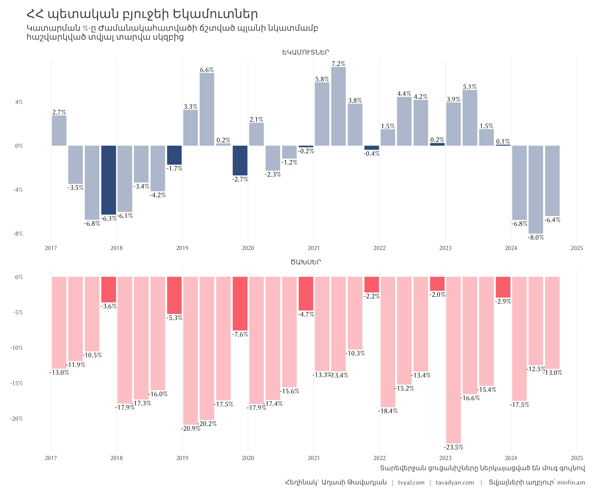
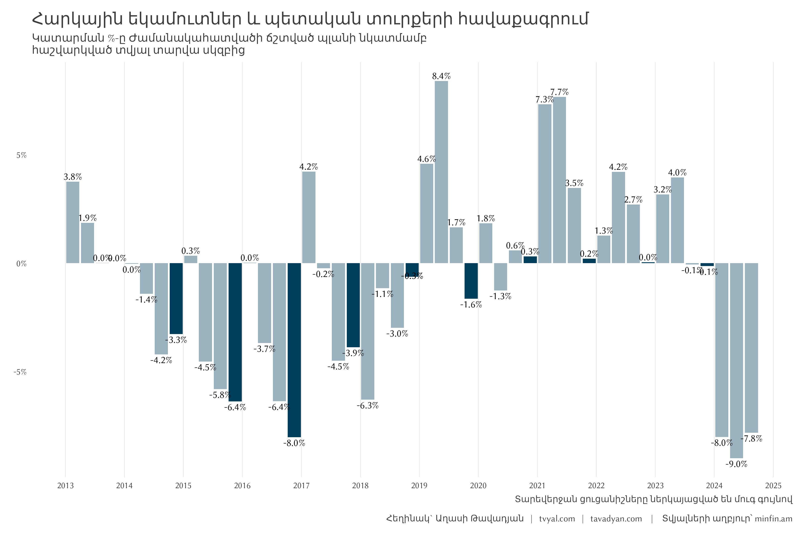

### Numbers Don't Lie

Trends in public finance are critically important for sustainable state development. When any organization, especially a state, chronically underperforms in planned revenue collection, it indicates systemic management issues.

These trends require special attention and comprehensive analysis. Over the past 15 years, Armenia hasn't recorded three consecutive quarters where tax collections were consistently below 7%, as shown in Figure 1.

Figure 1

Tax revenues, being the main source of state budget collection, are of paramount importance. When the state receives less income than planned, the likelihood of crisis phenomena increases significantly.

The situation in 2024 is particularly concerning, as it shows significant tax under-collection. This phenomenon is not due to failures of the State Revenue Committee (SRC) but rather results from ineffective fiscal policy.

This situation led to significant changes in the government composition on October 18, including the resignation of the SRC chairman.

It's worth noting that since 2018, tax collection growth has become the main performance indicator of the current government's effectiveness, which in the current economic situation has become an end in itself. From 2018 to 2023, tax revenues grew by an average of 15.6% annually. However, there is currently a clear issue of tax revenue underperformance.

It's important to emphasize that this situation is not due to SRC failures. Moreover, since tax collection is one of the government's key performance indicators, it directly determines the volume of bonuses.

To address the tax revenue shortfall, the government has recently undertaken several measures - tightening tax collection, introducing new taxes and fees, eliminating existing tax benefits, and increasing certain tax rates.

These measures include, for example, discussions about double taxation of mortgage loan income tax returns and doubling the turnover tax rate from 5% to 10% from the beginning of 2025. It is also planned to terminate tax benefits for the IT sector from the beginning of 2025.

Within this policy framework, the government's rhetoric has also formed, according to which the tax collector is a "hero" who should be toasted.

It is undeniable that tax collection is the cornerstone of state operations, without which normal state functioning is impossible. Tax revenues, being the main source of the state budget, ensure funding for education, healthcare, defense, and social services.

However, as already mentioned, the current problems are not due to SRC operational failures but rather ineffective implementation of fiscal policy.

Currently, there are several fundamental problems in the economy, which have been analyzed in detail in our [tvyal.com publications](https://www.tvyal.com/newsletter). These include [the decrease in real export volumes](https://www.tvyal.com/newsletter/2024/2024_09_02), [economic growth dependence on gold re-exports from Russia](https://www.tvyal.com/newsletter/2024/2024_09_02), [reduction in registered organizations](https://www.tvyal.com/newsletter/2024/2024_10_14), [significant capital outflow](https://www.tvyal.com/newsletter/2024/2024_09_16), [decline in tourism](https://www.tvyal.com/newsletter/2024/2024_06_17), and [negative trends in the IT sector](https://www.tvyal.com/newsletter/2024/2024_08_19).

Among these systemic issues, [the reduction in tax collection volumes](https://www.tvyal.com/newsletter/2024/2024_08_02) is notable, mainly expressed through decreases in VAT and profit tax. This directly indicates a decline in the number of transactions in the real economy and organizations' profitability. In other words, there is a significant reduction in trade turnover volumes.

Under such conditions, it is unrealistic to expect additional tax revenues from citizens and economic entities. Such a policy could lead to the opposite result. Under conditions of real economy contraction and increased tax burden, economic entities may resort to various solutions - relocating to other countries (especially in the IT sector), facing bankruptcy, or moving into the shadow economy.

Tax revenue underperformance is a serious economic indicator, not just a statistical deviation. During the first nine months of the current year, the shortfall in planned tax revenues amounted to about 8 percent or 150 billion drams. Notably, this underperformance was recorded despite economic growth of around 6 percent.

The 12.6% economic growth recorded in Armenia in 2022 was mainly an indirect consequence of sanctions against Russia. As a result of this situation, significant capital and human resources moved to Armenia from Russia, especially from the IT sector.

In 2022, the banking system's net profitability recorded almost triple growth, thanks to which the IT and banking sectors together provided approximately half of the annual 12.6% economic growth. However, this phenomenon was temporary and began to significantly fade from mid-2023. Moreover, capital began to move in the opposite direction, flowing out of the country, which poses a serious challenge for our economy that is heavily dependent on external financing.

From November 2023, however, another short-term economic phenomenon emerged - significant re-export of gold and diamonds from Russia to Greater China and the UAE. This process contributed to the 8.3% economic growth in 2023, providing about 2 percentage points of it.

In our previous research, we have already noted that in the first half of 2024, [72% of Armenia's export structure consisted of precious stones and metals re-export](https://www.tvyal.com/newsletter/2024/2024_07_05), an unprecedented figure. This indicator effectively masked the decline in exports of all other product groups and downward trends in the real economy. During this period, gold re-export operations and trade transactions were the main driving forces of Armenia's economic growth.

However, this phenomenon, being conditioned by external factors of a short-term nature, has already started showing signs of decline since May 2024. In the current situation, the economy lacks a stable internal source of growth that could guarantee the government's targeted desired annual 7% economic growth.

Under such conditions, the unreasonably high economic growth forecasts underlying the budget contain significant risks and could lead to crisis phenomena in the form of decreased tax revenues and increased public debt, signs of which are already visible.

It is noteworthy that the government has already begun to realize the seriousness of these problems, which we have been voicing for more than two years, and has projected a more moderate growth rate of 5.4% in the 2025 budget. However, even this relatively restrained forecast appears overly optimistic in the current situation.

Armenia's economy's long-term average growth rate is 4.5%. Any system, without significant qualitative changes, tends to return to its long-term average indicators.

Currently, Armenia's economic growth is predominantly conditioned by short-term external factors emanating from Russia, which, however, cannot serve as a basis for long-term sustainable internal economic growth.

The situation is also complicated chronologically. Armenia's economic growth indicators, especially the 12.6% in 2022, have created extremely optimistic assessments, even claims about an "economic miracle." However, as in-depth analysis shows, behind this apparent success lies a significantly more complex and concerning reality.

> **Related publications**
>
> [🚨📉🕵 Hidden Decline: What's Driving Armenia's Economy](https://www.tvyal.com/newsletter/2024/2024_09_30)
>
> [💸🔚🏦 From Capital Inflow to Outflow](https://www.tvyal.com/newsletter/2024/2024_09_16)
>
> [🧮⏳🎲 Armenia is Taxing Time: Playing with Economic Growth](https://www.tvyal.com/newsletter/2024/2024_08_02)
>
> [💰🚧⚖️ Public Debt Pendulum: For the First Time, Domestic Debt Exceeds External](https://www.tvyal.com/newsletter/2024/2024_06_28)
>
> [🆘🇦🇲🧑🏼‍💻 SOS Armenian IT: From Strategic Priority to Potential Decline](https://www.tvyal.com/newsletter/2024/2024_08_19)
>
> [Complete list of analyses here](https://www.tvyal.com/newsletter)

Figure 2

The second figure shows the performance of Armenia's state budget revenues and expenditures relative to planned indicators. As the data shows, the budget's expenditure part shows an underperformance trend until year-end, when the main part of expenditures is implemented. In this context, particularly problematic were the years when significant underperformance was recorded in year-end tax revenues.

To provide a clear assessment of the government programs' effectiveness, it is necessary to wait for the final expenditure figures at year-end. However, some concerning trends are already visible, particularly in the IT sector, which will be detailed in the next section.

For the first 9 months, total state budget expenditure underperformance was approximately 13% or 290 billion drams. More concerning is the 30% or 124 billion dram underperformance in capital expenditures (school construction, reservoir construction, road construction, etc.). The Ministry of Economy's economic support programs underperformed by 26%, mainly due to low performance in investment, export promotion, and agricultural sector programs.

Notably, after a long-term decline in the agricultural sector, slight growth was recorded during the first nine months of the current year. Meanwhile, without accounting for Russian gold re-export operations, the industrial sector also recorded almost zero growth. More concerning is the 8.5% decline in the information and communication sector, as well as the 13% decline recorded in the information technology sector.

Under these conditions, the risk of public debt growth increases significantly. According to current fiscal rules, when Government debt exceeds 60% of GDP, the executive body is obligated to limit current expenditures and present a clear debt reduction program. The Ministry of Finance aims to maintain the public debt/GDP ratio within 50% in its medium-term policy framework. However, with budget underperformance, economic growth slowdown, and possible AMD depreciation, there is a serious risk that the public debt/GDP ratio could exceed the 60% threshold. Under current trends, the probability of this scenario is sensitive.

### IT Sector Underperformance

Table 1


<iframe src="plots/gt_table_hightech_performance.html" width="100%" height="600px" frameborder="0"></iframe>


Perhaps nowhere are the problems between economies more evident than in Armenia's technology sector. This sector was declared as the country's strategic branch for sustainable growth. Currently, the IT sector shows concerning signs. The Ministry of High-Tech Industry has managed to implement only 58.4% of its planned budget, significantly underperforming, which also raises concerns about this sector's health. These sector problems were also decoded in our latest research [🆘🇦🇲🧑🏼‍💻 SOS Armenian IT: From Strategic Priority to Potential Decline](https://www.tvyal.com/newsletter/2024/2024_08_19).

The numbers tell a not-so-positive story. According to official data, the Ministry's total expenditures amounted to only 7.8 billion drams - half of planned expenditures. For a sector that should be the driving force of Armenia's economic future, this is quite a telling indicator, more than just budget statistics. This also indicates strategic regression in the sector.

Recent data shows that the IT sector has recorded negative growth over the last three quarters, which may indicate a crisis in this strategic sector. The upturn that began in 2022, mainly driven by the influx of specialists from Russia, has started to fade. Although the number of registered IT companies in Armenia has sharply decreased, the number of foreign-registered but Armenia-operating IT companies has shown interesting growth. However, this shift doesn't correspond with employee numbers, suggesting data inaccuracy or mass closure of small businesses.

This decline is caused by several factors, including AMD appreciation, tax policy changes, high cost of living in Yerevan, and ineffective fiscal policy. Currency strengthening has particularly negatively affected export-oriented sectors like IT. Additionally, the termination of tax benefits for IT companies and possible doubling of turnover tax for small and medium enterprises makes neighboring countries like Georgia more attractive for IT business. The situation is further complicated by capital outflow and reduced inflow. As Armenia's IT sector approaches a crucial phase, reviewing development strategies, reconsidering tax policy, and exploring opportunities to create new IT centers outside Yerevan becomes urgent to maintain the sector's competitiveness and growth.

In conclusion, Armenia's economy faces complex and multilayered challenges. Tax revenue underperformance, budget expenditure underperformance, IT sector decline, and dependence on external factors create serious risks for long-term sustainable development. Without systemic reforms and economic policy revision, talks about an "economic miracle" could transform into a real threat of economic crisis. Particularly important is the revision of fiscal policy, development of a new IT sector strategy, and economic diversification to reduce dependence on temporary external factors. Solving these problems requires not only rapid response but also a long-term, consistent, and balanced approach.

-----

You can familiarize yourself with the Ministry of Finance's budget performance reports by visiting this [official link](https://minfin.am/hy/page/petakan_byujei_hashvetvutyun/). For a more in-depth understanding of this topic, you can also read [the official analysis of RA state budget execution for the first 9 months of 2024](https://minfin.am/website/images/files/2.%20_2024_9%20.docx).

####### Media Coverage

### **[The Economy Appears to be Recovering, but This is an Illusion and Irony](https://youtu.be/Qnylq8qqEQQ)**

During the 2025 budget discussions in Parliament, Civil Contract MPs announced that there would be no salary and pension increases next year, while essential food prices are rising. In parallel, state debt will increase to a debt/GDP ratio of 54.6%. Economist Aghasi Tavadyan, founder of tvyal.com, shared his views on the risks of next year's budget and the government's policy that caused it in [Panorama-Interviews](https://www.panorama.am/am/news/2024/11/13/%D4%B1%D5%B2%D5%A1%D5%BD%D5%AB-%D4%B9%D5%A1%D5%BE%D5%A1%D5%A4%D5%B5%D5%A1%D5%B6/3077888).

Key points from the interview:

* This budget is problematic in several aspects. Mainly, revenues are continuously declining, leading to issues in state budget expenditures.
* The government claims they will ensure 7% economic growth for 50% growth over 6 years. While commendable, without real production to support long-term growth, this is problematic.
* Our economy relies on external money rather than production, achieving growth through the banking system, making it dependent on external rather than internal factors.
* Currently, about 70% of our exports - billions worth - is gold re-export, which distorted the picture.
* Economic growth figures (initially reported at 9.2%) created an illusion of recovery, but half of this growth came from gold re-exports. The figure was revised down to 6.4% and is likely to decrease further.
* Exports are declining across all directions: EAEU exports down 20%, EU exports down 25% (now only 3.6% of total).
* The government has lowered growth targets from 7% to 5.4% for next year, though even this remains optimistic.
* While the government has taken good steps in managing debt (over 50% in drams), risks remain, especially given the AMD's significant appreciation.

[Full interview in the attached video.](https://youtu.be/Qnylq8qqEQQ)

### **[Watch the 1in.am Interview Discussing Budget Performance and Armenia's Economic Ailments](https://youtu.be/tNEGkDCOvy4?t=123)**

📺 Armenia's economy is highly dependent on Russia: this affects our foreign policy 📺

---

Best regards,
Aghasi Tavadyan
19.11.2024
[tvyal.com](https://www.tvyal.com/)
[tavadyan.com](https://www.tavadyan.com/)

---

[Was this email forwarded to you? Subscribe here.](https://www.tvyal.com/subscribe)

---

####### **Notice: Your email is part of the mailing list where I share weekly materials primarily focused on the Armenian economy. These materials encompass charts, [databases](https://github.com/tavad/tvyal_newsletter), videos, articles, [online dashboards](https://www.tvyal.com/projects), economic tools, forecasts, and reports. If you wish to unsubscribe, please let me know, and I will remove your email from the list. Please share your comments as well.**
